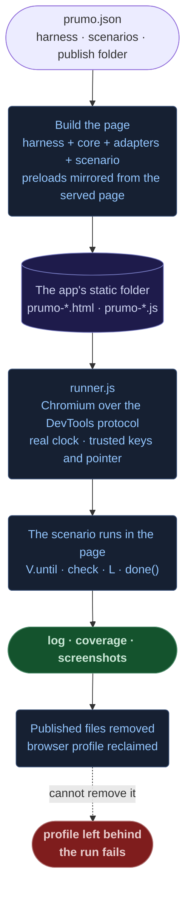

<div align="center">

# Prumo

[](https://github.com/FDTTO/prumo/actions/workflows/ci.yml) [](https://www.python.org/) [](https://nodejs.org/) [](https://www.chromium.org/) [](LICENSE)

<br/>

**Checks a web page in a real browser, against its design and its own claims.**

Drives the page in headless Chromium on the real clock, runs scenarios written as plain JavaScript, and answers what a unit test cannot: does it still behave, which styles and functions does no check reach, would a check notice if this function broke, and does the page match its design, property by property.

No dependencies beyond the standard libraries of Python and Node. Born checking the [EMIT](https://github.com/FDTTO/emit) console, where it runs 34 scenarios at every width they declare, in CI.

<br/>

</div>

```
$ python tools/prumo suite --coverage
PASS anatomy                 1280px  15/15 checks
PASS authorize               1280px  10/10 checks
PASS camera                  1280px  5/5 checks
PASS carry                   1280px  8/8 checks
PASS chain                   1280px  5/5 checks
PASS cockpit                 1280px  13/13 checks
...

coverage across 39 runs
  styles      844 of 956 rules applied at least once
  scripts     429 of 464 functions in 29 modules ran at least once
```

<div align="center">

*Prumo is Portuguese for a plumb line: the weighted string a builder holds against a wall to know it stands true to the plan.*

</div>

---

## Table of Contents

- [The Problem](#the-problem)
- [How a Run Works](#how-a-run-works)
- [Structural Decisions](#structural-decisions)
- [What It Caught](#what-it-caught)
- [Quick Start](#quick-start)
- [Reference](#reference)
- [Deliberate Limits](#deliberate-limits)
- [Roadmap](#roadmap)

---

## The Problem

Checks of a user interface fail in predictable ways, and every one of them passes.

- **A check that cannot fail.** It asserts that a dialog exists in the DOM; the dialog is 0x0 inside a hidden ancestor. Green, and the reader sees nothing.
- **A clock instead of a condition.** It reads the page after ten seconds. On a loaded machine the page is not there yet, or worse, it still shows the previous state and the check passes.
- **A harness that drifts.** The test page copies production's configuration by hand. The copy ages, and the suite measures a page nobody is served.
- **A match by impression.** "It looks like the mockup" survives until a padding of 8px becomes 10px, and nobody can say which property of which element moved.

Prumo treats each as a structural problem: checks proven to fail, waits on conditions, a harness that mirrors what is served, and a design compared property by property.

---

## How a Run Works



The page a scenario runs in is served by the app itself, on the same origin as everything it checks, so the browser loads the code the app really serves; what a scenario fakes, such as a response, it fakes on purpose and in plain sight. Everything Prumo writes is named `prumo-*`, removed when the run ends, and never counted as the project's code.

---

## Structural Decisions

| Concern | Chosen | Rejected | Root reason |
|:---|:---|:---|:---|
| Clock | Real clock by default | A virtual-time budget | Timers against a real backend run out in under a second on virtual time |
| Waiting | Conditions (`V.until`) | Sleeps | A fixed time passes on a fast machine and reads the old state on a loaded one |
| Input | Trusted events over the protocol | Synthetic DOM events | `:focus-visible` and `:hover` follow only real input |
| Harness | Mirrors the served page | Configuration copied by hand | A copy drifts, and the suite measures a page nobody receives |
| Browser profile | Owned by the process that outlives the browser | Removed by the runner | Windows keeps it locked for seconds after the browser exits |
| Coverage total | Parsed from the stylesheets on disk | The browser's report | The browser reports only the rules it applied |
| Distribution | A submodule, standard libraries only | Packages on npm and PyPI | One pinned commit: nothing to install, nothing to release twice |

**The real clock by default.** A virtual-time budget skips idle time, so a poll that backs off 1s, 2s, 4s spends its whole schedule in under a second and reports a state no reader ever sees. `--virtual` stays for long, mostly idle scenarios, and cannot judge animation frames.

**Conditions, not clocks.** Every wait in the core and the adapters is on a condition. A run under `--coverage`, which slows the page, is the stress test that finds the clocks left in a scenario, and in the code under test. A wait that runs out is reported even when the run passes (`PASS ... 1 wait ran out`): a condition that never holds is a sleep in disguise, and the checks after it pass anyway.

**Trusted input.** Chromium shows `:focus-visible` only after real keyboard input and `:hover` only under a real pointer, so a synthetic event from inside the page proves neither. Keys and the pointer go over the DevTools protocol, and scenarios that send them run alone, since browsers in parallel contend for them.

**A harness that mirrors.** The harness reads the served configuration where it can; Prumo copies the served page's module preloads into it and refuses to run when the two load different stylesheets.

**The profile belongs to the survivor.** On Windows the launched browser hands off to another process and exits, and under load its profile stays locked after it closes. Prumo creates each profile, hands it to the runner, and reclaims it after the runner exits, waiting out the locks; a profile that still cannot be removed fails the run.

---

## What It Caught

Each of these was reproduced before it was fixed, and measured after.

- **Its own runner filled a disk.** Under load, Windows held a browser profile longer than the runner waited for it; the runner gave up with a warning nothing read. 116 profiles and 1.7 GB accumulated before a run failed with `ENOSPC`. With seven browsers at once, 13 of 21 runs leaked; with the profile owned by the parent, none of 21 did.
- **A server's queue of five connections.** Python's local server queues five pending connections; Chromium opens several per page, and with a few browsers running, pages hung loading in 9 of 32 runs. With a queue of 64, none of the runs with a 30 s wait did.
- **A protocol-relative URL.** A project publishing at the root turned the script path into `//prumo-core.js`, a URL to another host. Prumo's own checks caught it the day they were written.
- **A jump that landed short.** In the EMIT console, choosing an operation from the map corrected its scroll only within four seconds; on a busy page the scroll ended later, and the operation sat 202 px low with the one above it marked current. Under coverage it failed 7 of 18 runs before the fix and none of 12 after.
- **Clocks in a suite.** EMIT's suite waited on fixed times in three places, the helper that executes an operation and two scenarios; they failed only under `--coverage`, which is how they were found.

Moving the tooling out of EMIT changed nothing it measures: the same 844 of 956 rules and 429 of 464 functions covered, and 1,653 fidelity roles compared with no difference.

---

## Quick Start

Requires Python 3.10+, Node 22+ and any Chromium: Edge, Chrome or Chromium, found where they install, or named with `--browser` or `PRUMO_BROWSER`. Pillow, only for `diff`.

```bash
git submodule add https://github.com/FDTTO/prumo tools/prumo
python tools/prumo suite
```

Describe the page in a `prumo.json` at the project's root:

```json
{
  "base": "http://localhost:8080",
  "publish": { "dir": "target/classes/static/app", "url": "/app/" },
  "harness": "test/ui/harness.html",
  "mirror": "/index.html",
  "adapters": ["swagger-ui"],
  "scenarios": "test/ui/scenarios"
}
```

and write a scenario:

```js
// @widths 375,1280
// A saved draft says so.
V.until(function () { return !!document.querySelector('#save'); }, function () {
  document.querySelector('#save').click();
  V.until(function () { return V.text('#status') === 'Saved'; }, function () {
    check('the draft is saved', V.text('#status') === 'Saved', V.text('#status'));
    done();
  });
});
```

---

## Reference

### Commands

| Command | What it answers |
|:---|:---|
| `suite [DIR]` | Every scenario at every width it declares, three at a time; `--only`, `--verbose`, `--coverage` |
| `run SCENARIO` | One scenario, its full log as JSON; `--width`, `--clip JS` for a screenshot of a region |
| `mutate` | Would a check notice this function breaking; `--only`, `--sample` |
| `fidelity [STATE]` | The page against its reference design, one state or all; `--only`, `--shots`, `--exact` |
| `diff BEFORE AFTER` | Two screenshots, and the box of the pixels that differ |
| `visit SCENARIO` | A scenario inside any page: `--url`, or `--serve DIR --at /path/` |

`--base URL` points any of them at another instance of the app; `--config` names a `prumo.json` other than the nearest one.

### The configuration

| Key | Meaning |
|:---|:---|
| `base` | Where the app runs |
| `publish` | A folder the app serves (`dir`) and the URL it serves it under (`url`): Prumo writes its pages there for a run, and coverage and mutation work on the files found there |
| `harness` | The project's page that boots what is checked, with nothing else |
| `mirror` | The served page the harness stands in for: its preloads are copied in, a different set of stylesheets is refused |
| `adapters` | Helpers for what the page is built on: `swagger-ui` for Swagger UI 5 |
| `scenarios` | The folder `suite` runs |
| `fidelity` | `states`, `roles`, `include`, `hide`, `viewport` (below) |

### Scenarios

A scenario runs inside the harness after Prumo's core and adapters, in its own function scope. `check(name, pass, detail)` is an expectation, `L(key, value)` a recorded value, `done()` the end of the run. A run fails when a check fails, a console error is logged, or it never calls `done()`. Its header sets how it runs: `@widths 320,1280`, `@wait MS` (a ceiling), `@virtual MS`, `@alone`.

| Core | |
|:---|:---|
| `V.until(ready, then, ms)` | Wait for a condition; on timeout, continue and log the condition as the cause |
| `V.press(key)`, `V.hover(selector)` | Real keys and pointer: `Tab`, `Shift+Tab`, `Enter`, `Escape`, `Space`, arrows |
| `V.rules(selector, property)` | Every rule that sets the property on the element, with its layer or media |
| `V.inventory()` | Every distinct radius, type size, family and border the page renders, with counts |
| `V.text`, `V.box`, `V.jwt(seconds, claims)` | Text, a box in page coordinates, a token with an exact expiry |
| `allowErrors(regex)` | Console errors a scenario provokes on purpose |

The `swagger-ui` adapter adds `V.open`, `V.execute` (open, Try it out, fill, Execute, each step waiting for what it presses), `V.fakeResponse`, `V.authorize`, `V.held`, `V.logoutHeld`, `V.response`, `V.status`, `V.json`, `V.param` and `V.definition`.

### Coverage and mutation

```
$ python tools/prumo suite --coverage --only saves
PASS saves                   1280px  1/1 checks
PASS saves                    375px  1/1 checks

coverage across 2 runs
  styles      2 of 5 rules applied at least once
  scripts     4 of 5 functions in 1 module ran at least once

  rules never applied:
    app.css:3     .never
    app.css:4     button:focus-visible
    app.css:6     .box:hover

  functions never run:
    app.js:11    never

$ python tools/prumo mutate --only save,decorate
KILLED   app.js:save                              by saves  (saves failed)
SURVIVED app.js:decorate                          by saves

1 of 2 mutants killed (50%)
survived, so no check depends on them: decorate
```

A rule never applied is dead or a state no scenario visits. A mutant knocks one named function out with a `return;`, is served in place of the original, and runs only the scenarios coverage shows running it; a survivor is a function that could stop working with the suite still green. Calibrate before trusting a score: what a check depends on must be killed, and what none does must survive.

### Matching the design

```
$ python tools/prumo fidelity plain
page
    h                115  ->  109
box
    h                34  ->  38
    padding          8px  ->  10px
only-in-reference
    drawn only in the reference

3 of 3 roles drawn in this state differ
```

A state is a scenario named for it, whose `// @reference design/mockup.html#state` header names the reference page, and which brings the page there and calls `measure()`. Roles pair a selector on each side, `[role, reference, page]`, in `window.__fidelityRoles`; the first is the frame every box is measured from. A role neither side draws in a state is not a difference; one side drawing it and the other not is. `include` holds helpers the states share, `hide` what the reference page draws around the design.

### Traps it already paid for

- **Programmatic focus is not keyboard focus.** After a click, `focus()` is pointer focus and never enters `:focus-visible`. Walk with `V.press('Tab')`.
- **A headless page may not hold the window's focus**, and keys sent to it go nowhere. The runner enables focus emulation.
- **Virtual time freezes transitions and starves `requestAnimationFrame`.** The browser runs with reduced motion; a harness whose page repaints through rAF should schedule it on a timer.
- **`--window-size` is ignored for pages opened over the protocol.** The runner sets the viewport itself, so 320px works.
- **`var name` at a script's top level is `window.name`**, which turns a function into a string. Scenarios run in their own function scope.
- **Existing in the DOM is not being visible.** Assert painted size and hit testing for anything a reader must see.
- **A page with no log says where it stopped:** its URL, whether it finished loading, whether Prumo's core ran.

---

## Deliberate Limits

- **Chromium only.** Edge, Chrome and Chromium; Firefox and Safari are not driven.
- **It writes into the folder the app serves.** That is what keeps the page on the app's origin. A site Prumo cannot write to is checked with `visit`, which injects the scenario instead.
- **Mutation knocks out named top-level functions.** Methods and arrow functions are not mutated.
- **Fidelity compares computed styles, not pixels.** Two layouts that draw the same thing differently read as different; `diff` compares pixels.
- **Verified on Linux and Windows.** The macOS paths exist and are not run in CI.

---

## Roadmap

- [x] Suite, coverage, mutation, fidelity, pixel diff and visit
- [x] CI on Linux and Windows, Python 3.10 and 3.12
- [x] The EMIT console checked through it, from a submodule
- [ ] A module check: every imported name exported, every export imported
- [ ] A vocabulary check, for kits that must not name the project using them
- [ ] macOS in CI

---

## Author

```
███████╗██████╗ ████████╗████████╗ ██████╗
██╔════╝██╔══██╗╚══██╔══╝╚══██╔══╝██╔═══██╗
█████╗  ██║  ██║   ██║      ██║   ██║   ██║
██╔══╝  ██║  ██║   ██║      ██║   ██║   ██║
██║     ██████╔╝   ██║      ██║   ╚██████╔╝
╚═╝     ╚═════╝    ╚═╝      ╚═╝    ╚═════╝
```

[LinkedIn](https://www.linkedin.com/in/matheusfedatto) · [GitHub](https://github.com/FDTTO)

---

## License

[MIT](LICENSE)
